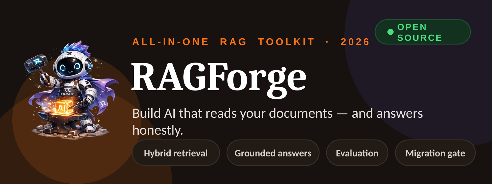

    

**Build AI that reads your documents and answers honestly — parsing, retrieval, grounded answers, and evaluation in one toolkit. Runs on your machine.**

---

## What happens when you gate a migration

```
$ ragforge migrate gate my-kb scifact_golden.json \
    --old all-MiniLM-L6-v2 \
    --new paraphrase-MiniLM-L3-v2

============================================================
  MIGRATION DECISION GATE
============================================================

  Metric                    Old Model    New Model     Delta
  ────────────────────  ────────────  ────────────  ──────────
  recall_at_k                  0.7379       0.5751   -0.1628 ◀
  precision_at_k               0.1640       0.1260   -0.0380
  mrr                          0.5997       0.4682   -0.1315

  Primary metric  : recall_at_k
  Threshold margin: 0.0
  Hot set         : 5183 chunks (of 5183 total)

  ✗ RECOMMENDATION: NO_GO — New model regresses recall_at_k:
                             0.7379 → 0.5751 (delta: -0.1628, exceeds margin 0.0)
============================================================

$ echo $?
1
```

↑ a real run on BEIR/SciFact (5,183 docs, 300 labelled queries). `paraphrase-MiniLM-L3-v2` is a *smaller* model — the point isn't that it's state-of-the-art and still lost. The point is that the gate measured a 16-point recall regression on this specific corpus and blocked the migration before a single chunk was re-embedded. Prove it on your data first.

---

## What is RAGForge?

Building a RAG system normally means gluing together half a dozen separate tools — a parser, a chunker, an embedder, a vector store, a retriever, and an LLM caller — with no consistent way to know if any of it works. RAGForge puts all of that into one library with a CLI, a Python API, and an HTTP server. It's for developers building document Q&A, knowledge-base search, or anything where an LLM needs to answer from a corpus rather than from training memory.

---

## Quick start

### Install

```bash
pip install ragforge                 # core — zero dependencies
pip install ragforge[pipeline]       # local embeddings + reranking (sentence-transformers)
pip install ragforge[api]            # HTTP server (FastAPI + Uvicorn)
pip install ragforge[pdf]            # PDF parsing (pypdf)
pip install ragforge[openai]         # OpenAI embeddings + LLM generation
pip install ragforge[anthropic]      # Anthropic LLM generation
pip install ragforge[docling]        # Docling parser for complex documents
pip install ragforge[ui]             # local web dashboard
pip install ragforge[all]            # everything
```

### Python

```python
from ragforge.pipeline import build_knowledge_base, query_knowledge_base

# Index documents
build_knowledge_base(name="my-kb", sources=["./docs/"])

# Retrieve relevant chunks
result = query_knowledge_base(knowledge="my-kb", question="How do refunds work?")
for chunk in result["chunks"]:
    print(f"  [{chunk['score']:.3f}] {chunk['text'][:100]}")

# Get a grounded answer
result = query_knowledge_base(
    knowledge="my-kb",
    question="How do refunds work?",
    generate=True,
    llm="ollama",        # or "openai" / "anthropic"
)
print(result["answer"])
```

The LLM is told to answer only from retrieved context. If the answer isn't there, it says so.

### CLI

```bash
ragforge knowledge build my-kb ./docs/          # index documents
ragforge query my-kb "How do refunds work?"     # hybrid search
ragforge query my-kb "How do refunds work?" \
  --generate --llm ollama                       # retrieve + grounded answer
ragforge eval run my-kb golden.json             # measure retrieval quality
ragforge serve                                  # start the HTTP API
ragforge ui                                     # open the local dashboard
```

### Local dashboard

```bash
pip install ragforge[ui]
ragforge ui
# Opens http://127.0.0.1:8000/ui — traces, evaluation results, live chat
```

---

## What's inside

| Module | What it does |
|--------|-------------|
| **Parsing** | `.txt`, `.md`, `.html`, `.pdf` → `Document`. Optional Docling backend for complex layouts — preserves tables and code blocks |
| **Chunking** | Fixed-size sliding window, structure-aware (splits on headings), or Docling-aware. Configurable token budget |
| **Retrieval** | Dense vector search + BM25, fused via Reciprocal Rank Fusion. Optional cross-encoder reranking |
| **Answers** | Grounded responses via OpenAI, Anthropic, or Ollama. Cites sources; refuses to hallucinate |
| **Evaluation** | Precision@k, recall@k, MRR, faithfulness. A/B compare two configs on the same golden set |
| **Quantization** | Compress embeddings; measure cost/quality tradeoff on your corpus before committing |
| **Migration** | Shadow-index a candidate model, gate on real retrieval metrics, swap atomically if GO |
| **Multi-agent** | Blackboard coordination: agents write to a shared store instead of calling each other directly |
| **Dashboard** | Local web UI — pipeline traces, evaluation results, live chat against your knowledge base |

---

## Use it from any language

Everything is available over a plain HTTP/JSON API. Any language with an HTTP client works.

```bash
pip install ragforge[api]
ragforge serve
# http://127.0.0.1:8000  ·  Swagger UI at /docs
```

```bash
# Build a knowledge base
curl -X POST http://127.0.0.1:8000/knowledge \
  -H "Content-Type: application/json" \
  -d '{"name": "my-kb", "sources": ["./docs/"]}'

# Query it
curl -X POST http://127.0.0.1:8000/query \
  -H "Content-Type: application/json" \
  -d '{"knowledge": "my-kb", "question": "How do refunds work?", "top_k": 3}'
```

Full working examples (curl, Python, JavaScript) in [`examples/clients/`](examples/clients/).

| Endpoint | Method | What it does |
|----------|--------|--------------|
| `/health` | GET | Server status + version |
| `/capabilities` | GET | Registered parsers, chunkers, embedders |
| `/parse` | POST | Text or file → Document |
| `/chunk` | POST | Document → Chunks |
| `/knowledge` | POST | Build / index a knowledge base |
| `/query` | POST | Hybrid search + optional LLM answer |
| `/evaluate` | POST | Score against a golden dataset |
| `/quantize` | POST | Compress embeddings, measure tradeoff |
| `/migrate/gate` | POST | GO / NO_GO before a model swap |
| `/migrate` | POST | Execute a (gated) migration |
| `/migrate/smoke-test` | POST | Post-migration verification |
| `/traces` | GET | Pipeline trace history |
| `/coordination/boards` | POST | Create a shared blackboard |
| `/coordination/run` | POST | Run a multi-agent task |

---

**Docs:** [rag-forge-website.vercel.app](https://rag-forge-website.vercel.app) &nbsp;·&nbsp; **GitHub:** [github.com/samsuljahith/RagForge](https://github.com/samsuljahith/RagForge) &nbsp;·&nbsp; Made by [Samsul Jahith](https://github.com/samsuljahith)

Apache-2.0. Contributions welcome — feedback especially. Open an issue or send a PR.
