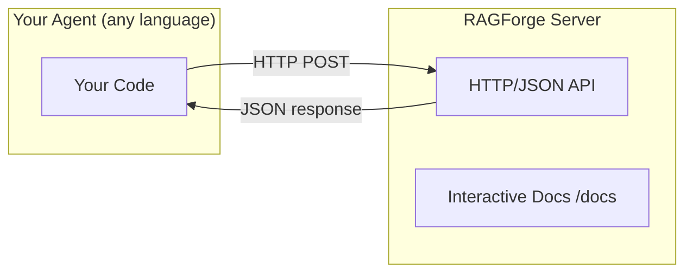

# Using from Any Language

This is RAGForge's key differentiator: **every feature is reachable over an HTTP/JSON API**. Your agent can be written in Python, JavaScript, Go, Java, C++, Rust, or anything else that can make HTTP requests.

## How It Works

RAGForge runs as a server (or Docker container). Your agent talks to it over plain HTTP:



## Starting the Server

```bash
# Install with API dependencies
pip install ragforge[api]

# Start the server
ragforge serve --host 0.0.0.0 --port 8000

# Or with Docker
docker run -p 8000:8000 ragforge
```

## Available Endpoints

| Endpoint | Method | Description |
|----------|--------|-------------|
| `/health` | GET | Server status + version |
| `/capabilities` | GET | List registered parsers, chunkers, etc. |
| `/parse` | POST | Parse text/file into a Document |
| `/chunk` | POST | Chunk a Document |
| `/knowledge` | POST | Build a knowledge base |
| `/query` | POST | Query a knowledge base |
| `/evaluate` | POST | Evaluate retrieval quality |
| `/quantize` | POST | Quantize and compare |
| `/migrate` | POST | Migrate between models |

## Interactive Documentation

FastAPI auto-generates interactive docs at:
- **Swagger UI**: `http://localhost:8000/docs`
- **ReDoc**: `http://localhost:8000/redoc`

You can try every endpoint directly from your browser — send requests and see responses without writing any code.

## The Pattern

Every endpoint follows the same pattern:

1. Send a JSON POST request
2. Get a JSON response
3. Use standard HTTP status codes for errors

```
POST /query
Content-Type: application/json

{"knowledge": "my-kb", "question": "...", "top_k": 5}

→ 200 OK
{"question": "...", "chunks": [...], "answer": null}
```

## Language Examples

See the [client examples](./clients) page for working code in Python, JavaScript, and curl. The same HTTP calls work from Go, Java, C++, Rust, Ruby, PHP — any language with an HTTP client.

## Why Not a Python SDK for Other Languages?

Because you don't need one. The API is simple enough that a few lines of HTTP calls in your language are clearer than learning a wrapper library. And you get:

- No dependency on a Python-specific SDK
- No version compatibility issues
- No build toolchain requirements
- Debugging with standard HTTP tools (curl, Postman, browser dev tools)

If you want a typed client in your language, you can auto-generate one from the OpenAPI schema at `/openapi.json`.
