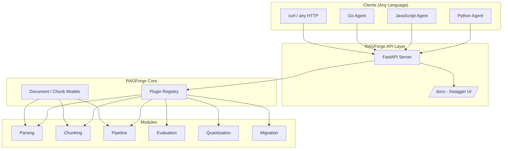
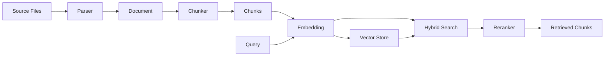
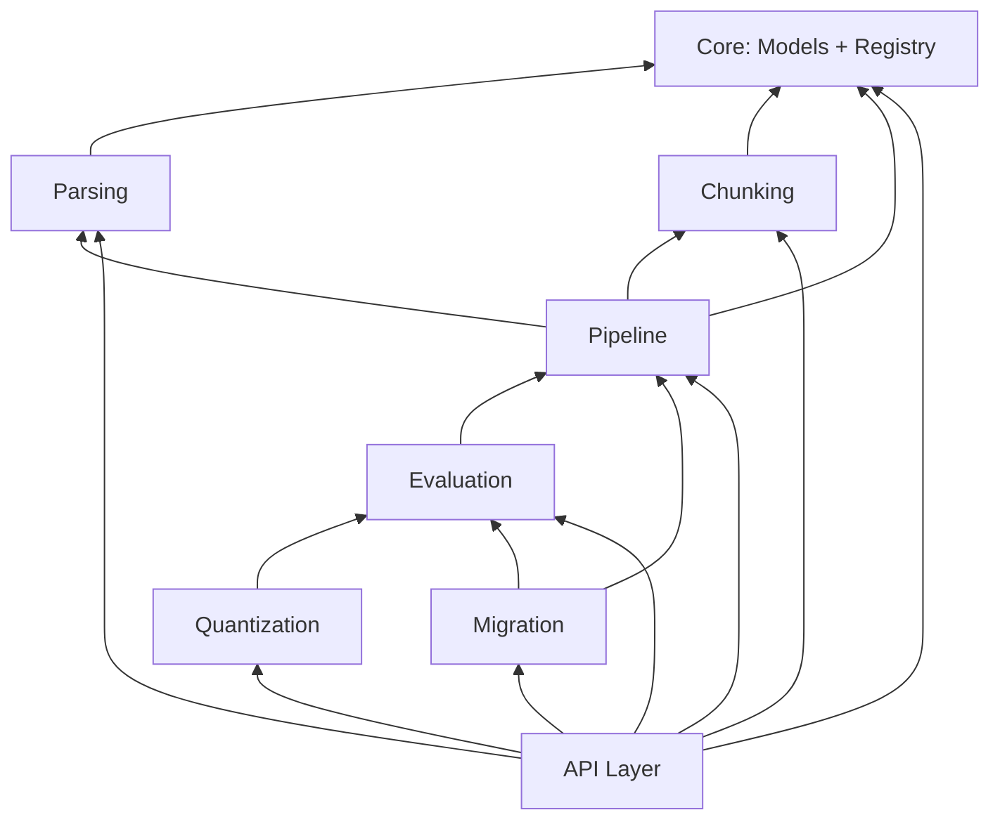

# Architecture

RAGForge is designed as independent modules under a shared core, connected by a plugin registry. This keeps each piece testable and replaceable while the whole system feels like one tool.

## System Overview



## Design Principles

### 1. Shared Core, Independent Modules

Every module depends on `core/` (the data models and registry) but never on each other unless there's a real dependency (e.g., evaluation depends on pipeline for querying).

### 2. Plugin Registry

The registry is the trick that keeps RAGForge extensible:

```python
from ragforge.core.registry import register

@register("chunker", "my-custom")
class MyChunker(Chunker):
    def chunk(self, document: Document) -> list[Chunk]:
        ...
```

Adding a new parser, chunker, or embedding model = adding one file. No giant central file to edit.

### 3. Dual Interface

Every feature works both ways:
- **Python library**: `import ragforge; rf.parse_file("x.md")`
- **HTTP API**: `POST /parse {"path": "x.md"}`

The API layer is a thin translation between HTTP/JSON and the Python modules.

### 4. Zero-Dep Core

The core install requires nothing. Heavy dependencies (FastAPI, ML models, vector DBs) live in optional extras so `pip install ragforge` is instant.

## Data Flow



## Module Dependencies


