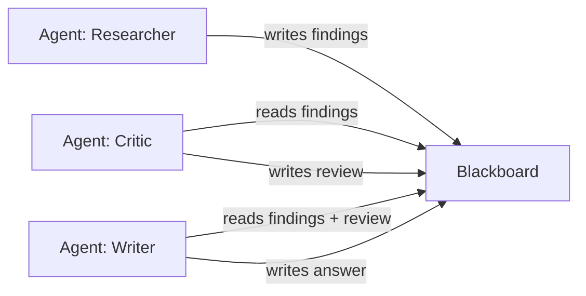

# Multi-Agent Coordination

RAGForge includes a coordination module for running multiple agents together using a shared blackboard — without the cost of direct agent-to-agent messaging.

## The Problem: Direct Messaging is Expensive

In most multi-agent systems, agents communicate by sending messages to each other. Each handoff looks like this:

```
Agent A → (full conversation so far) → LLM → response → Agent B → (full conversation + A's response) → LLM → response → Agent C → ...
```

The context window grows with every step. If your conversation is 2,000 tokens by step 3, Agent C receives all 2,000 tokens as input — even if it only needs 200 tokens of that. **Every handoff re-sends everything.**

This is the #1 cost driver in multi-agent systems.

## The Solution: Blackboard Coordination (Stigmergy)

Instead of passing messages directly, agents read and write a shared workspace called a **blackboard**:



Each agent:
1. Checks the board for its trigger condition (e.g. "findings exist but no review yet")
2. Reads only the entries it needs (not the full history)
3. Does its work (optionally calling an LLM with targeted context)
4. Writes results back with markers/tags

Agents **never call each other directly**. This is [stigmergy](https://en.wikipedia.org/wiki/Stigmergy) — agents react to signals left in the environment, like ants following pheromone trails.

## Why This is Cheaper

| | Direct Messaging | Blackboard |
|---|---|---|
| **Input tokens per step** | Full conversation history (grows) | Only the entries needed (targeted) |
| **Orchestration cost** | Often LLM-powered routing | Zero tokens (deterministic loop) |
| **Context growth** | Linear with steps | Flat (each agent reads what it needs) |
| **Crash recovery** | Lost in memory | Persisted to SQLite |
| **Observability** | Reconstruct from logs | Full history in the board |

The savings scale with task complexity. A 3-step task might save 10-15%. A 10-step task with growing context can save 40-70%.

## Quick Start

### Python Library

```python
from ragforge.coordination import (
    InMemoryBlackboard, Agent, AgentResult, Orchestrator
)

# Create a shared board
board = InMemoryBlackboard()
board.write("question", "How do refunds work?", author="user")

# Define agents with trigger conditions and actions
def researcher_trigger(b):
    return b.has_key("question") and not b.has_key("findings")

def researcher_action(b, agent_id):
    question = b.read("question")
    # ... query KB, call LLM ...
    b.write("findings", "Refunds take 3-5 business days...",
            author=agent_id, tags={"confidence": 0.85})
    return AgentResult(agent_id=agent_id,
                       entries_read=["question"],
                       entries_written=["findings"],
                       tokens_used=200)

agents = [Agent(id="researcher", trigger=researcher_trigger, action=researcher_action)]

# Run until goal is met
orch = Orchestrator(board, agents,
                    goal=lambda b: b.has_key("final_answer"),
                    max_steps=20)
result = orch.run()

print(f"Done: {result.termination_reason}")
print(f"Steps: {len(result.steps)}, Tokens: {result.total_tokens}")
```

### CLI

```bash
# Run a multi-agent task from a config file
ragforge agents run examples/multi_agent_coordination.py

# Compare direct-messaging vs blackboard cost
ragforge agents benchmark examples/multi_agent_coordination.py

# Inspect a persisted blackboard
ragforge agents board my-task
```

### API

```bash
# Create a board and seed it
curl -X POST http://localhost:8000/coordination/boards \
  -H "Content-Type: application/json" \
  -d '{"name": "my-task"}'

curl -X POST http://localhost:8000/coordination/boards/my-task/write \
  -H "Content-Type: application/json" \
  -d '{"key": "question", "value": "How do refunds work?", "author": "user"}'

# Run a coordination task
curl -X POST http://localhost:8000/coordination/run \
  -H "Content-Type: application/json" \
  -d '{
    "board_name": "demo",
    "agents": [
      {"id": "processor", "trigger_key": "input", "trigger_condition": "missing:output",
       "output_key": "output", "output_value": "processed"}
    ],
    "seed": [{"key": "input", "value": "raw data", "author": "user"}],
    "goal_key": "output"
  }'
```

## Blackboard

The blackboard is a key/value store where each entry carries:

| Field | Description |
|-------|-------------|
| `key` | String identifier |
| `value` | Any JSON-serializable data |
| `author` | Agent ID that wrote it |
| `timestamp` | When it was written (ISO 8601) |
| `tags` | Markers/pheromones (e.g. `{"status": "ready", "confidence": 0.9}`) |
| `version` | Auto-incrementing per key |

### Persistence

By default, blackboards persist to SQLite (`~/.ragforge/boards/<name>.db`). If an agent crashes, the shared state remains — other agents can pick up where it left off.

Use `InMemoryBlackboard` for ephemeral/test tasks.

### Tags (Pheromones)

Tags are the stigmergy mechanism. Agents leave lightweight signals:

```python
board.write("findings", data, author="researcher",
            tags={"status": "pending_review", "confidence": 0.6})

# Another agent reacts to tags
low_confidence = board.read_by_tag("confidence", lambda v: v < 0.7)
```

## Agents

An agent has:
- **id**: unique name
- **trigger**: function that checks the board → returns True when this agent should run
- **action**: function that reads entries, does work, writes results back
- **max_fires**: optional limit (prevents infinite loops)

Agents are deliberately lightweight — no framework magic. The logic lives in the trigger/action functions.

## Orchestrator

The orchestrator is a simple loop:
1. Check which agents' triggers are satisfied
2. If none → quiescence (done)
3. Run the first eligible agent (list order = priority)
4. Check goal condition
5. Repeat

**Safety features:**
- `max_steps`: hard limit on total executions
- Deadlock detection: if the board doesn't change 3 times in a row
- Per-agent `max_fires`: prevents one agent from looping

## Cost Benchmark

The benchmark utility runs the same task two ways and compares:

```bash
ragforge agents benchmark examples/multi_agent_coordination.py
```

Output:
```
════════════════════════════════════════════════════════════
  BENCHMARK: Research → Review → Write (3-agent coordination)
════════════════════════════════════════════════════════════
  Metric                    Direct   Blackboard    Savings
  ─────────────────────── ──────── ──────────── ──────────
  Total tokens                 802          721        +81
  LLM calls                      3            3         +0
  Est. cost (USD)          $0.0072      $0.0068    $0.0004

  Token savings: 10.1% fewer tokens with blackboard
════════════════════════════════════════════════════════════
```

:::info Honesty note
Savings depend on the task. Short tasks with little shared context show modest savings. Tasks with many handoffs and growing context windows show dramatic savings. The benchmark measures YOUR actual task — not a cherry-picked demo.
:::

## API Endpoints

| Endpoint | Method | Description |
|----------|--------|-------------|
| `/coordination/boards` | POST | Create a blackboard |
| `/coordination/boards/{name}` | GET | Get board state |
| `/coordination/boards/{name}/write` | POST | Write an entry |
| `/coordination/boards/{name}/history` | GET | Get write history |
| `/coordination/boards/{name}` | DELETE | Clear a board |
| `/coordination/run` | POST | Run a coordination task |
| `/coordination/run/{run_id}` | GET | Get run trace + cost |

## Tracing

Coordination runs are automatically traced using the same tracing system as pipeline queries. They show up in the UI dashboard with:
- Which agent fired at each step
- What it read/wrote
- Tokens used per step
- Total cost

Use `traced_run()` instead of `Orchestrator.run()` directly:

```python
from ragforge.coordination import traced_run

result = traced_run(board, agents, goal=goal_fn)
# Trace saved to ~/.ragforge/traces.db — visible in the UI
```
