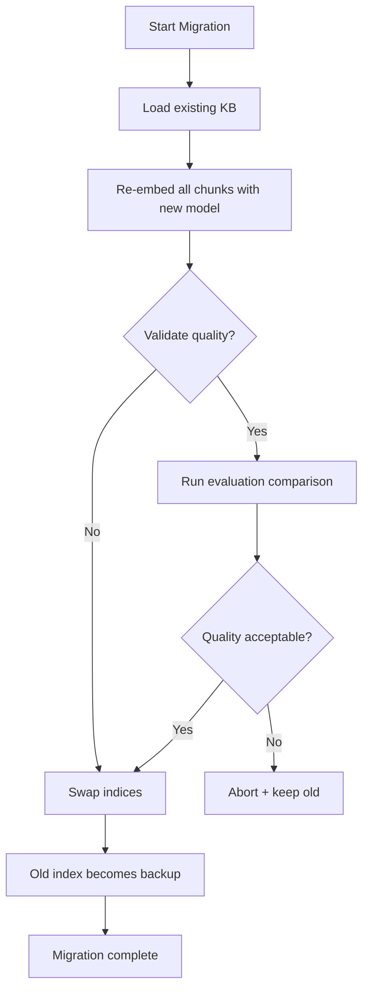

# Embedding Model Migration

Safely move a knowledge base from embedding model A to model B. The hardest module — it re-embeds all chunks, validates quality with evaluation, and performs a safe cutover.

## Quick Start

```python
from ragforge.migration import migrate_knowledge_base

result = migrate_knowledge_base(
    knowledge="my-kb",
    from_model="default",
    to_model="quantized",
    validate=True,
)

print(f"Status: {result['status']}")
print(f"Chunks migrated: {result['num_chunks_migrated']}")
print(f"Quality before: {result['quality_before']}")
print(f"Quality after:  {result['quality_after']}")
```

## How It Works



1. **Load**: Read all chunks from the existing knowledge base
2. **Shadow index**: Re-embed everything with the new model (builds alongside, doesn't touch the old)
3. **Validate**: Run retrieval comparisons to ensure quality is maintained
4. **Cutover**: Swap the new index into place, keep the old as backup

## API

```bash
curl -X POST http://localhost:8000/migrate \
  -H "Content-Type: application/json" \
  -d '{
    "knowledge": "my-kb",
    "from_model": "default",
    "to_model": "quantized",
    "run_validation": true
  }'
```

## Safety Features

- **Shadow indexing**: The new index is built alongside the old one. Nothing is lost during migration.
- **Quality validation**: Automatic before/after comparison ensures retrieval quality isn't degraded.
- **Backup**: The old vectors are kept as a backup file until you explicitly delete them.
- **Atomic swap**: The cutover happens in one step — either the new index is live or the old one is.

## When to Migrate

- Upgrading to a better embedding model
- Moving from a general model to a domain-specific one
- Switching providers (e.g., OpenAI → open-source)
- Downgrading to a cheaper model after confirming quality is acceptable (use quantization module first to check)
