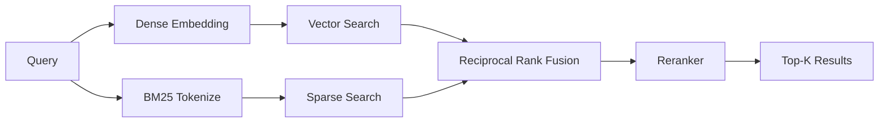

# Building a RAG Pipeline

The pipeline module ties parsing, chunking, embedding, and retrieval into a working system. It supports hybrid search (dense vectors + BM25 sparse retrieval) with reciprocal rank fusion and optional reranking.

## Quick Start

```python
from ragforge.pipeline import build_knowledge_base, query_knowledge_base

# Index your documents
result = build_knowledge_base(
    name="company-docs",
    sources=["./docs/", "./policies/refund.md"],
    embedding_model="default",
    chunk_strategy="structure",
)
print(f"Indexed {result['num_documents']} docs, {result['num_chunks']} chunks")

# Query with hybrid search
answer = query_knowledge_base(
    knowledge="company-docs",
    question="What is the refund window for electronics?",
    top_k=5,
    rerank=True,
)

for chunk in answer["chunks"]:
    print(f"  [{chunk['score']:.3f}] {chunk['text'][:100]}...")
```

## How It Works



1. **Dense search**: Embed the query and find similar vectors via cosine similarity
2. **Sparse search**: BM25 keyword matching for terms dense search might miss
3. **Fusion**: Reciprocal Rank Fusion combines both ranked lists
4. **Reranking**: Boost chunks with strong exact-match overlap

## CLI

```bash
# Build a knowledge base
ragforge knowledge build my-kb ./docs/ --strategy structure

# Query it
ragforge knowledge query my-kb "How do refunds work?" --top-k 5

# JSON output
ragforge knowledge query my-kb "How do refunds work?" --json
```

## API

```bash
# Build
curl -X POST http://localhost:8000/knowledge \
  -H "Content-Type: application/json" \
  -d '{
    "name": "my-kb",
    "sources": ["./docs/"],
    "chunk_strategy": "structure"
  }'

# Query
curl -X POST http://localhost:8000/query \
  -H "Content-Type: application/json" \
  -d '{
    "knowledge": "my-kb",
    "question": "What is the refund policy?",
    "top_k": 5
  }'
```

## Embedding Models

The default embedding is a hash-based model that requires no external dependencies — good for testing and development. For production, register a real model:

| Model | Install | Use Case |
|-------|---------|----------|
| `default` | None | Development/testing |
| `quantized` | None | Testing quantization effects |
| Custom | Varies | Production (sentence-transformers, OpenAI, etc.) |

## Storage

Knowledge bases are persisted to `~/.ragforge/knowledge_bases/<name>/`. Each contains:
- `vectors.json` — the embedded chunks and vectors
- `meta.json` — metadata (model, strategy, counts)

## Pluggability

Both the embedding model and vector store are pluggable via the registry. Register your own to use different backends:

```python
from ragforge.core.registry import register
from ragforge.pipeline.embeddings import EmbeddingModel

@register("embedding", "openai")
class OpenAIEmbedding(EmbeddingModel):
    def embed(self, text: str) -> list[float]:
        # Call OpenAI API
        ...

    @property
    def dimension(self) -> int:
        return 1536
```
