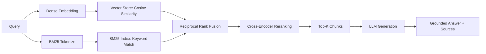

# RAG Pipeline & Answer Generation

The pipeline module is the heart of RAGForge: embed chunks, store them, retrieve with hybrid search, optionally rerank, and generate grounded answers with source citations.

## Quick Start

```python
from ragforge.pipeline import KnowledgeBase

# Build: parse → chunk → embed → store
kb = KnowledgeBase.build(name="my-kb", sources=["./docs/"], chunk_strategy="structure")

# Retrieve: hybrid search (dense + BM25 fused via RRF)
results = kb.query("How do refunds work?", mode="hybrid", top_k=5)
for chunk, score in results:
    print(f"  [{score:.3f}] {chunk.text[:80]}...")

# Generate: grounded answer with source citations
result = kb.answer("How do refunds work?", llm="ollama")
print(result["answer"])
```

## How Retrieval Works



1. **Dense search**: Embed the query, find similar vectors via cosine similarity
2. **BM25 search**: Keyword matching for terms dense search might miss
3. **Fusion**: Reciprocal Rank Fusion combines both ranked lists without needing score calibration
4. **Reranking** (optional): Cross-encoder scores each chunk against the query for precision
5. **Generation** (optional): LLM produces a grounded answer citing the retrieved chunks

## Retrieval Modes

| Mode | What it does | When to use |
|------|-------------|-------------|
| `dense` | Vector similarity only | Fast, good for semantic queries |
| `bm25` | Keyword matching only | Good for exact terms, names, codes |
| `hybrid` | Dense + BM25 via RRF | Best overall — catches both semantic and keyword matches |

## Answer Generation

RAGForge can generate grounded answers from retrieved chunks using any supported LLM provider:

```python
# Using the functional API
from ragforge.pipeline import query_knowledge_base

result = query_knowledge_base(
    knowledge="my-kb",
    question="What is the refund policy?",
    generate=True,
    llm="ollama",  # or "openai", "anthropic"
)

print(result["answer"])   # Grounded answer
print(result["chunks"])   # Source chunks with scores
```

### LLM Providers

| Provider | Install | Default model |
|----------|---------|---------------|
| `ollama` | None (uses local Ollama) | `llama3.2` |
| `openai` | `pip install ragforge[openai]` | `gpt-4o-mini` |
| `anthropic` | `pip install ragforge[anthropic]` | `claude-3-haiku-20240307` |

The generation prompt is designed to:
- Only answer from the provided chunks (grounded, no hallucination)
- Cite which chunks support the answer
- Refuse if the chunks don't contain relevant information

## CLI

```bash
# Build a knowledge base
ragforge knowledge build my-kb ./docs/ --strategy structure

# Query (retrieval only)
ragforge query my-kb "How do refunds work?" --mode hybrid --rerank

# Query with generated answer
ragforge query my-kb "How do refunds work?" --generate --llm ollama

# Choose a different model
ragforge query my-kb "Summarize the API" --generate --llm openai --model gpt-4o

# JSON output
ragforge query my-kb "refund policy" --json
```

## API

```bash
# Build a knowledge base
curl -X POST http://localhost:8000/knowledge \
  -H "Content-Type: application/json" \
  -d '{
    "name": "my-kb",
    "sources": ["./docs/"],
    "chunk_strategy": "structure"
  }'

# Query (retrieval only)
curl -X POST http://localhost:8000/query \
  -H "Content-Type: application/json" \
  -d '{
    "knowledge": "my-kb",
    "question": "What is the refund policy?",
    "mode": "hybrid",
    "top_k": 5,
    "rerank": true
  }'

# Query with generated answer
curl -X POST http://localhost:8000/query \
  -H "Content-Type: application/json" \
  -d '{
    "knowledge": "my-kb",
    "question": "What is the refund policy?",
    "generate": true,
    "llm": "ollama"
  }'
```

Example response:
```json
{
  "question": "What is the refund policy?",
  "knowledge": "my-kb",
  "answer": "The refund policy allows returns within 30 days...",
  "llm": "ollama",
  "chunks": [
    {"text": "Our refund policy...", "score": 0.89, "index": 0, "metadata": {"section": "Refunds"}}
  ]
}
```

## Embedding Models

| Model | Install | Description |
|-------|---------|-------------|
| `default` | None | Hash-based (zero deps, for dev/testing) |
| `sentence-transformers` | `pip install ragforge[pipeline]` | Local sentence-transformers models |
| `openai` | `pip install ragforge[openai]` | OpenAI text-embedding-ada-002 |

```python
# Build with a specific embedder
kb = KnowledgeBase.build(
    name="prod-kb",
    sources=["./docs/"],
    embedding_model="sentence-transformers",
)
```

## Storage & Persistence

Knowledge bases persist to `~/.ragforge/knowledge_bases/<name>/`. They include embedded vectors, BM25 index, and metadata. Load an existing KB:

```python
kb = KnowledgeBase.load("my-kb")
results = kb.query("refund policy")
```

## Configuration Options

### KnowledgeBase.build()

| Parameter | Default | Description |
|-----------|---------|-------------|
| `name` | required | Knowledge base name |
| `sources` | required | List of files/directories to index |
| `embedding_model` | `"default"` | Embedder to use |
| `chunk_strategy` | `"structure"` | Chunking strategy |

### KnowledgeBase.query()

| Parameter | Default | Description |
|-----------|---------|-------------|
| `question` | required | The query text |
| `mode` | `"hybrid"` | Retrieval mode: dense, bm25, hybrid |
| `top_k` | `5` | Number of results |
| `rerank` | `False` | Apply cross-encoder reranking |

### KnowledgeBase.answer()

| Parameter | Default | Description |
|-----------|---------|-------------|
| `question` | required | The query text |
| `llm` | required | Provider: "openai", "anthropic", "ollama" |
| `mode` | `"hybrid"` | Retrieval mode |
| `top_k` | `5` | Chunks to retrieve as context |
| `rerank` | `False` | Apply reranking before generation |
