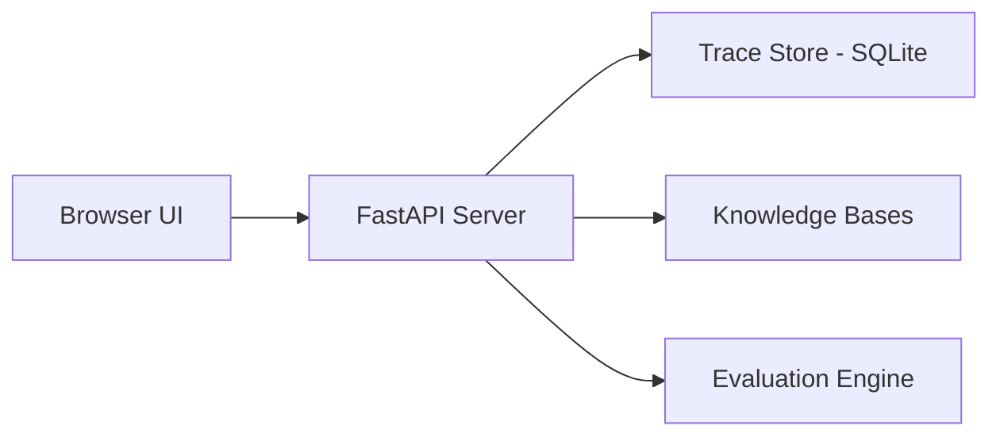

# Local UI Dashboard

RAGForge includes a local web dashboard for observing, debugging, and interacting with your RAG system. Launch it with one command and get three views: traces, evaluation, and chat.

Think of it as the "developer tools" for your RAG pipeline — see what happened under the hood without digging through logs.

## Install & Launch

```bash
pip install ragforge[ui]
ragforge ui
```

This starts the API server with a web frontend mounted at `http://localhost:8000/ui`. A browser window opens automatically.

```bash
# Custom port, no auto-open browser
ragforge ui --port 9000 --no-browser
```

## Three Views

### 1. Traces

Every pipeline query is automatically traced and stored in SQLite (`~/.ragforge/traces.db`). The Traces view shows:

- **Timeline** of all queries with timestamps, duration, and status
- **Step-by-step breakdown** of each query: retrieval (what was searched, what was found), reranking, prompt construction, LLM response
- **Token counts and timing** per step
- **Coordination traces** — multi-agent runs also appear here, showing which agent fired and what it wrote

Use this to debug why a query returned bad results — was it retrieval (wrong chunks), reranking (good chunks filtered out), or generation (LLM hallucinated)?

### 2. Evaluation

Run evaluations from the UI and view results:

- Score dashboard showing retrieval metrics (hit rate, MRR, precision)
- Per-query drill-down: see which questions failed and why
- Historical comparison: track how metrics change over time

### 3. Chat

Interactive RAG chat interface:

- Ask questions against any loaded knowledge base
- See the retrieved chunks alongside the generated answer
- Source highlighting shows which chunks were used
- Useful for quick manual testing and demos

## Architecture



The UI is a pre-built React+Vite single-page app served as static files from `ragforge/ui_static/`. The backend uses the same FastAPI app as the main API — no separate server needed.

## API Endpoints (used by the UI)

| Endpoint | Description |
|----------|-------------|
| `GET /traces` | List recent traces |
| `GET /traces/{run_id}` | Get full trace detail |
| `POST /ui/eval/run` | Run evaluation from UI |
| `GET /ui/eval/history` | Get evaluation history |
| `POST /ui/chat` | Send a chat message (query + generate) |

These endpoints are available when running `ragforge serve` or `ragforge ui`.

## When to Use

- **Debugging**: A query returns bad results → open traces, see what went wrong at each step
- **Demo**: Show stakeholders that your RAG system finds and cites correct sources
- **Evaluation**: Run evals without the CLI, compare results visually
- **Development**: Quick feedback loop while tweaking chunking/embedding strategies
